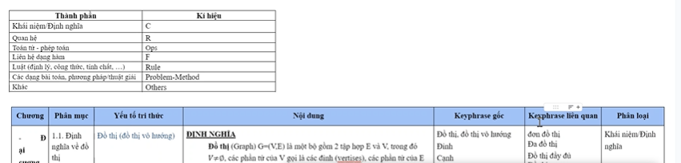
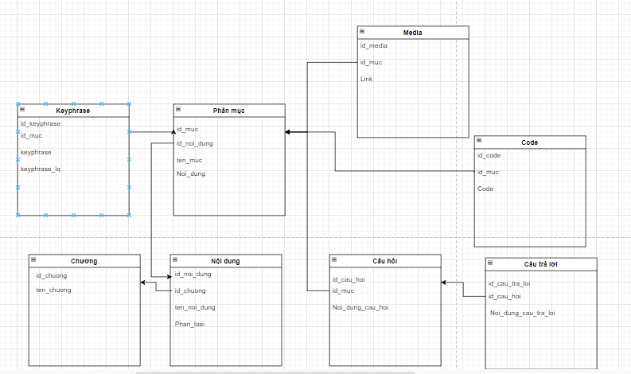

# Đây là backend của Hệ thống trắc nghiệm tri thức
| Name              | ID Student | Email                           |
| ----------------- | ---------- | ------------------------------- |
| Lê Ái Quốc Vinh   | 4501104277 | vinh.laq.cntt@gmail.com         |
| Lê Tấn Lộc        | 4501104135 | ah09program@gmail.com           |
| Huỳnh Thanh Phong | 4501104172 | 4501104172@student.hcmue.edu.vn |
- Hệ thống hoá kiến thức nhập môn lập trình bằng ngôn ngữ C++ theo từng lĩnh vực
	+ tổ chức theo phân loại bài học
	+ tổ chức theo **phân loại miền tri thức** (khái niệm, bài tập, tính chất,...)
	
- Kiểm tra & đánh giá khả năng người học (trắc nghiệm)
  + Dựa vào tỉ lệ số câu trả lời đúng trong bài kiểm tra
     -> Đánh giá điểm tổng theo các bài kiểm tra

  + Dựa vào tỉ lệ số câu trả lời đúng theo từng lĩnh vực trong hệ thống đề 
     -> Đánh giá điểm mạnh/yếu của người học dựa theo kết quả từng lĩnh vực 

Góp ý:
  - hỗ trợ tra cứu thêm dạng **phân loại** kiến thức (theo bài tập, khái niệm, tính chất,...)
  - hỗ trợ trắc nghiệm dựa trên từng bài học, sau đó tạo ra trắc nghiệm tổng hợp, câu hỏi liên kết được bài học, liên kết được theo kiến thức đã đặc tả
 
 
 Bắt đầu làm là ngày 2/4/2022
 - [x] Cào data (23h59 2/4 - 23h59 3/4): 
   - [x] [CodeLearn](https://codelearn.io/learning/cpp-cho-nguoi-moi-bat-dau)  - Lộc
    - [x] Lộc phải bỏ file data vào folder data và tạo riêng ra folder riêng
    - [x] [LearnCPP](https://www.learncpp.com/)  - Vinh
    - [x] [Elib](https://www.elib.vn/huong-dan/chu-de/ngon-ngu-lap-trinh-c-.html)  - Phong
- [ ] Phân loại (0h 4/4 - 23h59 10/4):
	Phân loại theo khuôn mẫu file SL.xlxs
	Database : MongoDB
- Frontend : React (T.Phong)
  - [ ] 1. Lần 1(0h 10/4 - 23h59 15/4):
     - Danh sách các bài học + chương mục
     - Trang hiển thị bài học
     - Hệ thống tìm kiếm
  - [ ] 2. Lần 2(0h 16/4 - 23h59 19/4): 	
     - Trang kiểm tra trắc nghiệm (nơi bỏ câu hỏi + 4 đáp án dạng tick + nút nộp)
     - Hiện thị thông số học tập 
     - Thời gian làm bài
     - Liên kết với các bài học cần ôn tập
- Backend (Lộc, Vinh) : Django 

Hệ thống thiết kế theo như trong ảnh:

Sơ đồ Database:

  - [ ] 1. Lần 1(0h 23h59 - 23h59 16/4): 
  	- Thuật toán truy vấn (theo yêu cầu của góp ý)
  - [ ] 2. Lần 2(0h 17/4 - 23h59 20/4):
  	- Hệ thống kê đánh giá người đọc + đề xuất
- [ ] Làm sile + test hệ thống(0h 21/4 - lúc báo cáo) 
